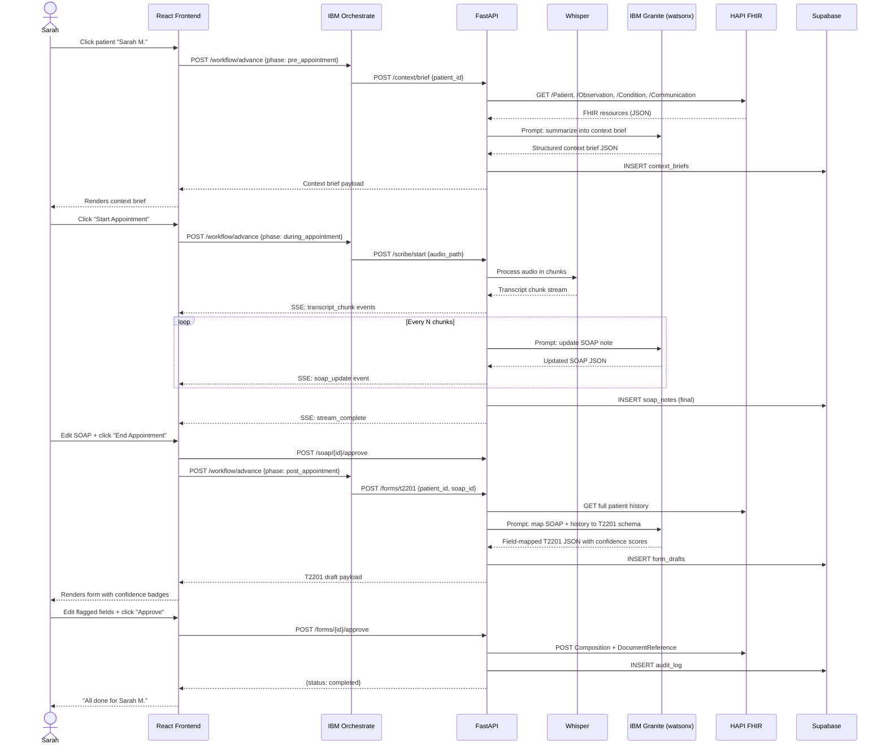
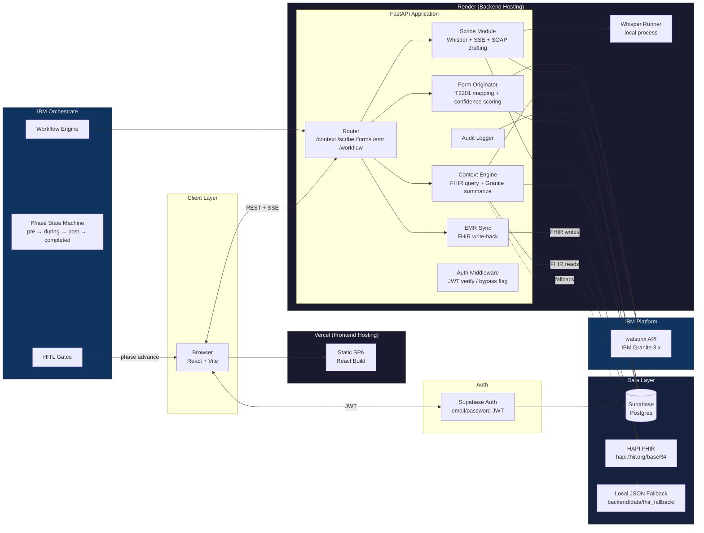
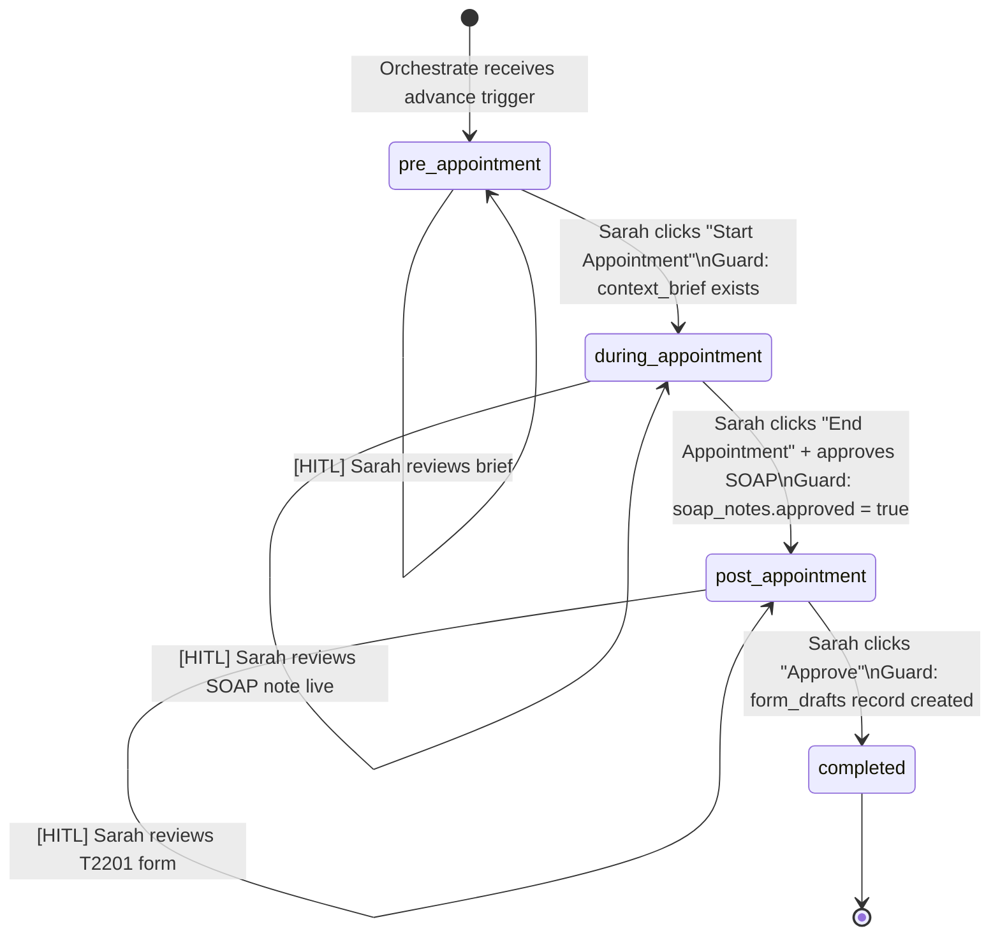

# Architecture: Ontario Family Physician AI Copilot

**Team:** Warriors — IBM SkillsBuild AI Experiential Learning Lab  
**Hackathon:** 10-week healthcare AI track  
**Last updated:** 2026-04-19

---

## Table of Contents

1. [Executive Summary](#1-executive-summary)
2. [Problem & Target User](#2-problem--target-user)
3. [Solution Overview](#3-solution-overview)
4. [End-to-End Workflow](#4-end-to-end-workflow)
5. [System Architecture Diagram](#5-system-architecture-diagram)
6. [Tech Stack](#6-tech-stack)
7. [Data Flow per Phase](#7-data-flow-per-phase)
8. [Database Schema](#8-database-schema)
9. [HAPI FHIR Integration](#9-hapi-fhir-integration)
10. [IBM Orchestrate Role](#10-ibm-orchestrate-role)
11. [Security & Governance Posture for MVP](#11-security--governance-posture-for-mvp)
12. [Deployment](#12-deployment)
13. [Out of Scope for MVP](#13-out-of-scope-for-mvp)

---

## 1. Executive Summary

Ontario family physicians lose 9+ hours per week to administrative documentation — time that comes entirely from personal hours and is uncompensated under OHIP. Existing solutions (EMR dictation, first-gen AI scribes) are point tools that automate individual tasks but leave the physician responsible for stitching outputs together across the pre/during/post appointment workflow. This product is a three-phase agentic AI copilot that spans the full appointment lifecycle: it surfaces a patient context brief before the appointment, transcribes and structures a SOAP note during it, and pre-fills complex external forms (starting with the T2201 Disability Tax Credit Certificate) after it. Every output is human-reviewed before the system writes back to the EMR, making the agent a force multiplier for clinical judgment rather than a replacement for it. The MVP targets Ontario family physicians using a HAPI FHIR-compatible EMR, with IBM Granite as the reasoning model and IBM Orchestrate as the phase router.

---

## 2. Problem & Target User

**Persona: Dr. Sarah Smith**

- 42 years old, family physician in Mississauga, Ontario
- 13 years in practice, panel of ~1,400 patients
- Works 10-hour clinical days; spends 9+ additional hours per week on paperwork
- Paperwork is entirely unpaid: OHIP bills per visit, not per form completed
- Highest-pain tasks: summarizing fragmented patient history before appointments, transcribing visit notes, and completing multi-page government forms like the T2201 (which requires cross-referencing years of records)
- Current tooling: EMR with basic dictation, no AI assistance
- Does not want AI to make clinical decisions; wants AI to handle information retrieval and first-draft generation so she can focus on judgment

Every design decision in this system is anchored to this persona. If a feature does not reduce Sarah's administrative burden or improve her confidence in the output, it is out of scope.

---

## 3. Solution Overview

### Layer 1: Pre-Appointment Context Engine

Before each appointment, the Context Engine queries the HAPI FHIR server for the patient's recent labs, correspondence (faxes, referral letters), active conditions, medications, and historical notes. The raw FHIR resources are passed to IBM Granite with a prompt instructing it to produce a structured bulleted brief organized by clinical domain (chronic conditions, recent changes, pending items, flags). The brief is persisted to Supabase and rendered on Sarah's Morning Dashboard before the patient arrives. Any data gaps (e.g., a referenced lab that doesn't exist in FHIR) are surfaced as explicit missing-data flags rather than silently omitted.

### Layer 2: Active Reasoning Scribe

During the appointment, a pre-recorded audio file is submitted to the backend. Whisper processes the audio in overlapping chunks and streams the transcript to the frontend via Server-Sent Events (SSE). In parallel, each transcript chunk is appended to a growing context window and fed to Granite, which maintains and updates a structured SOAP note (Subjective, Objective, Assessment, Plan) in real time. Granite also extracts candidate OHIP billing codes from the Assessment section and queues any lab requisitions mentioned in the Plan. The draft SOAP note updates live in the dashboard as the transcript accumulates.

### Layer 3: Autonomous Form Originator

After Sarah approves the SOAP note, the Form Originator takes the finalized note plus the full historical FHIR context and maps both to the fields defined in the T2201 JSON schema. Granite is prompted with the schema and asked to populate each field, returning a structured JSON object where each field carries a `value`, a `confidence` score (0.0–1.0), and a `source` citation (which FHIR resource or SOAP section the value was drawn from). Fields with confidence below 0.75 are highlighted in the dashboard for manual review. Sarah edits flagged fields, then approves the form. On approval, the backend writes a FHIR `Composition` and `DocumentReference` to the HAPI FHIR server and updates the audit log.

### Unified Architecture

```mermaid
flowchart TD
    subgraph Frontend ["React Dashboard (Vercel)"]
        A[Morning Dashboard] --> B[Context Brief View]
        A --> C[Scribe View – SSE transcript + SOAP]
        A --> D[Form Originator View – T2201]
    end

    subgraph Orchestrate ["IBM Orchestrate"]
        E[Workflow Engine] --> F{Phase Router}
        F --> G[pre_appointment]
        F --> H[during_appointment]
        F --> I[post_appointment]
        F --> J[completed]
    end

    subgraph Backend ["FastAPI on Render"]
        K[/context/brief] 
        L[/scribe/stream SSE]
        M[/forms/t2201]
        N[/emr/sync]
        O[FHIR Client]
        P[Whisper Runner]
        Q[Granite Client – watsonx]
        R[Supabase Client]
    end

    subgraph Data ["Data Layer"]
        S[(Supabase Postgres)]
        T[HAPI FHIR Server]
        U[Local JSON Fallback]
    end

    Frontend -- REST/SSE --> Backend
    Orchestrate -- Phase transition webhooks --> Backend
    Backend --> O --> T
    O -. fallback .-> U
    Backend --> P
    Backend --> Q
    Backend --> R --> S
```

---

## 4. End-to-End Workflow

### Step-by-step user journey

1. Sarah opens the dashboard → frontend calls `GET /patients` → Supabase returns her patient list for the day.
2. Sarah clicks patient "Sarah M." → frontend calls `POST /workflow/advance` with `{patient_id, phase: "pre_appointment"}` → Orchestrate receives the trigger.
3. Orchestrate validates the transition and calls `POST /context/brief` on the FastAPI backend.
4. FastAPI FHIR client queries `GET /Patient?identifier=…`, `GET /Observation?patient=…`, `GET /Condition?patient=…`, `GET /Communication?patient=…` on the HAPI FHIR server (or reads from local JSON fallback if `USE_FHIR_FALLBACK=true`).
5. FastAPI assembles the raw FHIR resources into a prompt and calls IBM Granite via watsonx. Granite returns a structured context brief (JSON).
6. Brief is written to `context_briefs` table in Supabase with `version=1`.
7. Frontend receives the brief and renders it in the Context Brief View. Missing-data flags are shown inline.
8. Sarah reviews the brief and clicks "Start Appointment".
9. Frontend calls `POST /workflow/advance` with `{phase: "during_appointment"}` → Orchestrate advances state and calls `POST /scribe/start`.
10. FastAPI receives the pre-recorded audio file path, spawns a background task running Whisper in chunk mode. Each chunk is transcribed and pushed to the SSE stream at `/scribe/stream/{appointment_id}`.
11. Frontend subscribes to the SSE stream and appends each transcript chunk to the live transcript view.
12. In parallel, after every N chunks (configurable, default 5), FastAPI calls Granite with the accumulated transcript and instruction to update the SOAP note. The updated SOAP note is pushed via SSE on a separate event type (`soap_update`).
13. After the audio file is fully processed, FastAPI persists the final transcript and SOAP note to `soap_notes` table with `version=1`. An SSE event `stream_complete` is emitted.
14. Sarah reviews the SOAP note, edits as needed, and clicks "End Appointment".
15. Frontend calls `POST /soap/{id}/approve` → Orchestrate advances to `post_appointment` and calls `POST /forms/t2201`.
16. FastAPI re-queries FHIR for the patient's full history, assembles the approved SOAP note + history into a prompt with the T2201 JSON schema, and calls Granite.
17. Granite returns a field-mapped JSON object with `value`, `confidence`, and `source` per field.
18. The form draft is written to `form_drafts` table with `version=1`. Low-confidence fields (`confidence < 0.75`) are flagged.
19. Frontend renders the T2201 form with confidence badges. Flagged fields are highlighted.
20. Sarah edits flagged fields and clicks "Approve".
21. Frontend calls `POST /forms/{id}/approve` → backend calls `POST /emr/sync`.
22. FastAPI writes a FHIR `Composition` and `DocumentReference` to the HAPI FHIR server.
23. Supabase `audit_log` is updated with `{event: "form_approved", actor: sarah_user_id, resource: form_draft_id}`.
24. Workflow state set to `completed`. Dashboard shows "All done for Sarah M."

### Sequence diagram



---

## 5. System Architecture Diagram



---

## 6. Tech Stack

| Layer | Technology | Rationale |
|---|---|---|
| **LLM** | IBM Granite 3.x via watsonx | Mandated by IBM SkillsBuild lab; Granite 3.x is instruction-tuned for structured output, handles clinical reasoning tasks without fine-tuning for this demo scope. No fallback provider — single dependency simplifies auth and prompt engineering. |
| **Backend framework** | Python 3.11 + FastAPI | AsyncIO-native, first-class SSE support via `StreamingResponse`, automatic OpenAPI docs, Pydantic v2 for schema validation. Python is the natural home for Whisper and LLM client libraries. |
| **Database** | Supabase (managed Postgres) | Provides Postgres, Auth, and a JavaScript client in one service; free tier is sufficient for MVP data volumes. Row-level security can be added post-MVP for PHIPA compliance. |
| **Frontend** | React 18 + Vite | Team familiarity; Vite's dev server handles SSE connections correctly without proxy configuration issues that webpack introduces. |
| **Frontend hosting** | Vercel | Zero-config deployment from Git, free tier, global CDN. Static SPA has no compute requirements. |
| **Speech-to-Text** | Whisper (faster-whisper) | Runs locally on the Render instance; no external API call means no latency spike and no data leaving the backend. `faster-whisper` uses CTranslate2 for 4x speed improvement over `openai-whisper` on CPU. |
| **Mock EMR** | HAPI FHIR public server (R4) | Speaking real FHIR R4 makes the integration real even though the patient data is fictional. The public server is stateful enough for our seed data to persist across the demo session. |
| **Orchestration** | IBM Orchestrate | Mandated by lab; used as a phase state machine and HITL gate controller. All clinical reasoning and data manipulation stays in FastAPI to keep Orchestrate's role narrow and testable. |
| **Backend hosting** | Render free tier | Free tier accepts FastAPI; cold start latency mitigated by keep-alive ping. Sufficient for demo-day traffic (single concurrent user). |
| **Auth** | Supabase Auth | Collocated with the database, JWT-based, trivial to integrate with the React client. `AUTH_ENABLED` flag allows complete bypass for demo sessions. |
| **API transport** | REST + SSE | REST for all request/response interactions; SSE (not WebSocket) for the scribe stream because SSE is unidirectional (server → client), stateless on the server, and works through Vercel's CDN without special configuration. |
| **IDs** | UUID v4 everywhere | Avoids sequential ID enumeration; consistent across all tables and FHIR resource references. |

---

## 7. Data Flow per Phase

### 7.1 Pre-Appointment

**Trigger:** Orchestrate calls `POST /context/brief` after phase advances to `pre_appointment`.

**Backend work:**
1. Validate `patient_id` exists in `patients` table.
2. FHIR client calls (parallel):
   - `GET /Patient?identifier={mrn}`
   - `GET /Condition?patient={fhir_id}&clinical-status=active`
   - `GET /Observation?patient={fhir_id}&_sort=-date&_count=10`
   - `GET /MedicationRequest?patient={fhir_id}&status=active`
   - `GET /Communication?recipient={fhir_id}&_sort=-sent&_count=5`
3. Assemble FHIR resources into a structured prompt context.

**LLM call:**
```json
{
  "model": "ibm/granite-3-8b-instruct",
  "messages": [
    {
      "role": "system",
      "content": "You are a clinical documentation assistant. Given raw FHIR resources for a patient, produce a structured context brief for the attending physician. Format: JSON with keys: chronic_conditions (array), recent_labs (array with flag if abnormal), active_medications (array), recent_correspondence (array), missing_data_flags (array of strings describing absent expected data). Be concise. Do not invent data not present in the FHIR resources."
    },
    {
      "role": "user",
      "content": "<FHIR_RESOURCES_JSON>"
    }
  ]
}
```

**Granite response (pseudo-payload):**
```json
{
  "chronic_conditions": ["Type 2 Diabetes (E11.9) — dx 2019", "Hypertension (I10) — dx 2021"],
  "recent_labs": [
    {"test": "HbA1c", "value": "8.2%", "date": "2026-03-15", "flag": "above_target"},
    {"test": "eGFR", "value": "61 mL/min", "date": "2026-03-15", "flag": "borderline"}
  ],
  "active_medications": ["Metformin 1000mg BID", "Ramipril 5mg OD"],
  "recent_correspondence": [
    {"type": "Cardiology referral response", "date": "2026-04-01", "summary": "Echo normal, no intervention needed"}
  ],
  "missing_data_flags": ["No recent lipid panel found (last >12 months)", "ODSP application status not reflected in EMR"]
}
```

**Persistence:**
```sql
INSERT INTO context_briefs (id, patient_id, appointment_id, brief_json, version, created_by)
VALUES (uuid_generate_v4(), $patient_id, $appointment_id, $brief_json::jsonb, 1, $physician_id);
```

**UI update:** Frontend `GET /context/brief/{appointment_id}` returns the brief; rendered as collapsible sections per domain with badge counts for flags.

---

### 7.2 During Appointment

**Trigger:** Orchestrate calls `POST /scribe/start` after phase advances to `during_appointment`. Payload includes `audio_file_path` (path on the Render instance where the pre-recorded file is staged).

**Backend work:**
1. Spawn async background task.
2. `faster-whisper` loads the audio file and processes in 30-second chunks with 5-second overlap.
3. Each chunk yields `{start_time, end_time, text}` as it completes.
4. Chunk is pushed to the SSE stream for `appointment_id`.
5. Running transcript buffer is maintained in memory.
6. Every 5 chunks (or on `stream_complete`), the buffer is sent to Granite for SOAP update.

**SSE event types:**
```
event: transcript_chunk
data: {"chunk_index": 3, "start": 90.0, "end": 120.0, "text": "Patient reports increased thirst and frequent urination over the past two weeks..."}

event: soap_update
data: {"subjective": "Patient reports polyuria and polydipsia x2 weeks...", "objective": "...", "assessment": "...", "plan": "..."}

event: billing_code_suggestion
data: {"codes": [{"code": "K01.1", "description": "General assessment", "confidence": 0.88}]}

event: stream_complete
data: {"total_chunks": 14, "duration_seconds": 412}
```

**LLM call (SOAP update):**
```json
{
  "model": "ibm/granite-3-8b-instruct",
  "messages": [
    {
      "role": "system",
      "content": "You are a medical scribe. Given a running transcript of a physician-patient encounter, maintain and return an updated SOAP note as JSON: {subjective, objective, assessment, plan}. Also extract candidate OHIP billing codes as [{code, description, confidence}]. Update only — do not remove prior content unless contradicted. Return only the JSON object."
    },
    {
      "role": "user",
      "content": "Current SOAP: <CURRENT_SOAP_JSON>\n\nNew transcript segment: <TRANSCRIPT_CHUNK>"
    }
  ]
}
```

**Persistence (on stream_complete):**
```sql
INSERT INTO soap_notes (id, appointment_id, patient_id, transcript_text, soap_json, billing_codes, version, created_by)
VALUES (uuid_generate_v4(), $appt_id, $patient_id, $full_transcript, $soap_json::jsonb, $codes::jsonb, 1, $physician_id);
```

**UI update:** Live transcript panel and SOAP note panel both update in real time via SSE. Billing code suggestions appear in a sidebar. Sarah can edit any field in the SOAP note directly.

---

### 7.3 Post-Appointment

**Trigger:** Orchestrate calls `POST /forms/t2201` after Sarah approves the SOAP note and phase advances to `post_appointment`.

**Backend work:**
1. Fetch approved `soap_notes` record.
2. Re-query FHIR for full patient history (conditions, observations, medications — no date limit).
3. Load T2201 JSON schema from `backend/schemas/t2201.json`.
4. Assemble prompt: schema + SOAP + full FHIR history.

**LLM call:**
```json
{
  "model": "ibm/granite-3-8b-instruct",
  "messages": [
    {
      "role": "system",
      "content": "You are a clinical documentation specialist. Given a T2201 Disability Tax Credit Certificate JSON schema, a SOAP note, and a patient's FHIR history, populate each schema field. Return a JSON object where each key maps to: {value, confidence (0.0-1.0), source (string citing the FHIR resource or SOAP section the value was drawn from)}. If a field cannot be populated from available data, set value to null and confidence to 0.0."
    },
    {
      "role": "user",
      "content": "Schema: <T2201_SCHEMA_JSON>\n\nSOAP Note: <SOAP_JSON>\n\nFHIR History: <FHIR_HISTORY_JSON>"
    }
  ]
}
```

**Granite response (pseudo-payload, partial):**
```json
{
  "patient_last_name": {"value": "M.", "confidence": 0.99, "source": "FHIR Patient.name"},
  "sin": {"value": null, "confidence": 0.0, "source": "not available in clinical records"},
  "diagnosis_code": {"value": "E11.9", "confidence": 0.97, "source": "FHIR Condition active list"},
  "marked_restriction_walking": {"value": true, "confidence": 0.62, "source": "SOAP Plan — 'patient reports difficulty with prolonged standing'"},
  "certifying_practitioner_cpso": {"value": null, "confidence": 0.0, "source": "not in FHIR — physician to enter"}
}
```

**Persistence:**
```sql
INSERT INTO form_drafts (id, appointment_id, patient_id, soap_note_id, form_type, form_json, version, created_by)
VALUES (uuid_generate_v4(), $appt_id, $patient_id, $soap_id, 'T2201', $form_json::jsonb, 1, $physician_id);
```

**UI update:** T2201 form rendered field-by-field. Fields with `confidence >= 0.75` show a green badge. Fields with `confidence < 0.75` show an amber badge and are focused for manual review. Source citations shown on hover. Sarah edits and clicks Approve.

**On approval:** `POST /emr/sync` → FHIR write-back + audit log entry + workflow `completed`.

---

## 8. Database Schema

All tables use Supabase (Postgres). All `id` columns are `UUID PRIMARY KEY DEFAULT uuid_generate_v4()`. All timestamps are `TIMESTAMPTZ DEFAULT now()`.

### 8.1 `patients`

| Column | Type | Constraints | Description |
|---|---|---|---|
| `id` | UUID | PK | Internal patient ID |
| `fhir_id` | TEXT | NOT NULL, UNIQUE | FHIR `Patient.id` on the HAPI server |
| `mrn` | TEXT | NOT NULL, UNIQUE | Medical record number used in FHIR identifier |
| `display_name` | TEXT | NOT NULL | Display name for UI (e.g., "Sarah M.") |
| `date_of_birth` | DATE | NOT NULL | Used for age calculations and form fields |
| `physician_id` | UUID | FK → `physicians.id` | Treating physician |
| `created_at` | TIMESTAMPTZ | | |

### 8.2 `appointments`

| Column | Type | Constraints | Description |
|---|---|---|---|
| `id` | UUID | PK | |
| `patient_id` | UUID | FK → `patients.id` NOT NULL | |
| `physician_id` | UUID | FK → `physicians.id` NOT NULL | |
| `scheduled_at` | TIMESTAMPTZ | NOT NULL | Appointment date/time |
| `phase` | TEXT | NOT NULL DEFAULT 'pre_appointment' | One of: `pre_appointment`, `during_appointment`, `post_appointment`, `completed` |
| `orchestrate_instance_id` | TEXT | | Orchestrate workflow instance ID for this appointment |
| `audio_file_path` | TEXT | | Server-local path to the pre-recorded audio file |
| `created_at` | TIMESTAMPTZ | | |
| `updated_at` | TIMESTAMPTZ | | Updated on every phase transition |

### 8.3 `context_briefs`

| Column | Type | Constraints | Description |
|---|---|---|---|
| `id` | UUID | PK | |
| `appointment_id` | UUID | FK → `appointments.id` NOT NULL | |
| `patient_id` | UUID | FK → `patients.id` NOT NULL | Denormalized for query convenience |
| `brief_json` | JSONB | NOT NULL | Full structured brief from Granite |
| `fhir_resources_snapshot` | JSONB | | Raw FHIR resources used to generate the brief |
| `version` | INT | NOT NULL DEFAULT 1 | Incremented each time a new brief is generated for the same appointment |
| `superseded_by` | UUID | FK → `context_briefs.id` NULLABLE | Points to the newer version; NULL means this is current |
| `created_by` | UUID | FK → `physicians.id` | |
| `created_at` | TIMESTAMPTZ | | |

### 8.4 `soap_notes`

| Column | Type | Constraints | Description |
|---|---|---|---|
| `id` | UUID | PK | |
| `appointment_id` | UUID | FK → `appointments.id` NOT NULL | |
| `patient_id` | UUID | FK → `patients.id` NOT NULL | |
| `transcript_text` | TEXT | NOT NULL | Full Whisper transcript |
| `soap_json` | JSONB | NOT NULL | `{subjective, objective, assessment, plan}` |
| `billing_codes` | JSONB | | Array of `{code, description, confidence}` |
| `approved` | BOOLEAN | NOT NULL DEFAULT FALSE | Set to true when Sarah clicks Approve |
| `approved_at` | TIMESTAMPTZ | NULLABLE | |
| `version` | INT | NOT NULL DEFAULT 1 | |
| `superseded_by` | UUID | FK → `soap_notes.id` NULLABLE | |
| `created_by` | UUID | FK → `physicians.id` | |
| `created_at` | TIMESTAMPTZ | | |

### 8.5 `form_drafts`

| Column | Type | Constraints | Description |
|---|---|---|---|
| `id` | UUID | PK | |
| `appointment_id` | UUID | FK → `appointments.id` NOT NULL | |
| `patient_id` | UUID | FK → `patients.id` NOT NULL | |
| `soap_note_id` | UUID | FK → `soap_notes.id` NOT NULL | The specific approved SOAP note used as input |
| `form_type` | TEXT | NOT NULL DEFAULT 'T2201' | Supports future multi-form extension |
| `form_json` | JSONB | NOT NULL | Field-mapped form with `{value, confidence, source}` per field |
| `approved` | BOOLEAN | NOT NULL DEFAULT FALSE | |
| `approved_at` | TIMESTAMPTZ | NULLABLE | |
| `fhir_composition_id` | TEXT | NULLABLE | FHIR `Composition.id` written on approval |
| `version` | INT | NOT NULL DEFAULT 1 | |
| `superseded_by` | UUID | FK → `form_drafts.id` NULLABLE | |
| `created_by` | UUID | FK → `physicians.id` | |
| `created_at` | TIMESTAMPTZ | | |

### 8.6 `audit_log`

| Column | Type | Constraints | Description |
|---|---|---|---|
| `id` | UUID | PK | |
| `event` | TEXT | NOT NULL | e.g., `context_brief_generated`, `soap_approved`, `form_approved`, `fhir_write_success`, `fhir_write_failed` |
| `actor_id` | UUID | FK → `physicians.id` NOT NULL | Who triggered the event |
| `resource_type` | TEXT | NOT NULL | e.g., `context_brief`, `soap_note`, `form_draft` |
| `resource_id` | UUID | NOT NULL | ID of the affected record |
| `appointment_id` | UUID | FK → `appointments.id` NOT NULL | |
| `metadata` | JSONB | | Additional context: FHIR response codes, Granite latency, diff of approved edits |
| `created_at` | TIMESTAMPTZ | | Immutable — append-only table |

> **Versioning policy:** When Sarah regenerates a brief or SOAP note (e.g., re-runs the scribe), the backend inserts a new row with `version = current_max + 1` and sets `superseded_by` on the old row to point to the new row's ID. The UI fetches `WHERE superseded_by IS NULL` to get the current version. Approving a version does not prevent regeneration; regenerating after approval creates version N+1 with `approved=false` and requires re-approval.

---

## 9. HAPI FHIR Integration

### Why HAPI FHIR public server

The HAPI FHIR public test server (`https://hapi.fhir.org/baseR4`) speaks real FHIR R4. Our code makes genuine HTTP calls against a real FHIR API — the only fiction is the patient data. This means the integration is production-representative even in a demo context.

### Seed data

The fictional patient "Sarah M." is seeded via a script at `scripts/seed_fhir.py`. The script uses the FHIR REST API to create:

| Resource | Count | Details |
|---|---|---|
| `Patient` | 1 | Sarah M., DOB 1978-07-22, MRN `WARRIOR-001` |
| `Condition` | 2 | Type 2 Diabetes (E11.9, onset 2019), Hypertension (I10, onset 2021) |
| `Observation` | 4 | HbA1c 8.2% (2026-03-15), eGFR 61 (2026-03-15), BP 138/88 (2026-03-15), Lipid panel (2024-11-01, intentionally old to trigger missing-data flag) |
| `MedicationRequest` | 2 | Metformin 1000mg BID, Ramipril 5mg OD |
| `Communication` | 1 | Cardiology referral response, 2026-04-01 |

`scripts/seed_fhir.py` is idempotent — it checks for `identifier=WARRIOR-001` before creating resources. Seeded FHIR IDs are written to `backend/data/fhir_seed_ids.json` so the application can look them up without searching.

### FHIR reads (Context Engine)

```python
# backend/services/fhir_client.py
async def get_patient_context(mrn: str) -> dict:
    if settings.USE_FHIR_FALLBACK:
        return load_fallback(mrn)
    
    base = settings.FHIR_BASE_URL  # https://hapi.fhir.org/baseR4
    patient = await get(f"{base}/Patient?identifier={mrn}")
    fhir_id = patient["entry"][0]["resource"]["id"]
    
    conditions, observations, medications, communications = await asyncio.gather(
        get(f"{base}/Condition?patient={fhir_id}&clinical-status=active"),
        get(f"{base}/Observation?patient={fhir_id}&_sort=-date&_count=10"),
        get(f"{base}/MedicationRequest?patient={fhir_id}&status=active"),
        get(f"{base}/Communication?recipient={fhir_id}&_sort=-sent&_count=5"),
    )
    return {"patient": patient, "conditions": conditions, ...}
```

### FHIR writes (EMR sync)

On form approval, the backend writes two resources:

1. **`Composition`** — Represents the completed clinical note for the encounter. Contains a `section` referencing the approved SOAP text.
2. **`DocumentReference`** — Points to the approved T2201 form JSON as a base64-encoded `application/json` attachment.

```python
# backend/services/emr_sync.py
async def write_approved_form(appointment_id: str, form_draft: FormDraft):
    composition = build_composition_resource(appointment_id, form_draft)
    doc_ref = build_document_reference(form_draft)
    
    comp_resp = await fhir_post(f"{FHIR_BASE}/Composition", composition)
    doc_resp  = await fhir_post(f"{FHIR_BASE}/DocumentReference", doc_ref)
    
    await audit_log(event="fhir_write_success", metadata={
        "composition_id": comp_resp["id"],
        "document_reference_id": doc_resp["id"],
    })
```

### Local JSON fallback

`backend/data/fhir_fallback/` mirrors the seed data as static JSON files:

```
backend/data/fhir_fallback/
├── patient_WARRIOR-001.json
├── conditions_WARRIOR-001.json
├── observations_WARRIOR-001.json
├── medications_WARRIOR-001.json
└── communications_WARRIOR-001.json
```

`USE_FHIR_FALLBACK=true` in `.env` routes all FHIR reads to these files. FHIR writes are no-ops when fallback is active (logged but not executed). This is the primary safety net for demo day if the HAPI public server is unavailable.

---

## 10. IBM Orchestrate Role

### What lives in Orchestrate

Orchestrate owns the **phase state machine** and the **HITL gates**. It does not perform any reasoning, data transformation, or FHIR interaction.

| Responsibility | Where it lives |
|---|---|
| Phase transitions (`pre → during → post → completed`) | Orchestrate |
| HITL gate: "Sarah must approve context brief before appointment starts" | Orchestrate |
| HITL gate: "Sarah must approve SOAP note before form generation" | Orchestrate |
| HITL gate: "Sarah must approve form before FHIR write" | Orchestrate |
| Guard: block `during_appointment` if no `context_briefs` row for appointment | Orchestrate |
| Guard: block `post_appointment` if `soap_notes.approved = false` | Orchestrate |
| Context Engine FHIR queries | FastAPI |
| Whisper transcription | FastAPI (local process) |
| Granite LLM calls | FastAPI |
| SOAP note structuring | FastAPI |
| T2201 field mapping | FastAPI |
| FHIR write-back | FastAPI |
| Audit logging | FastAPI |

### Phase transition flow



### Orchestrate → FastAPI interface

Orchestrate calls FastAPI via HTTP webhook on each phase transition:

| Phase | Orchestrate webhook call |
|---|---|
| `pre_appointment` | `POST /context/brief {patient_id, appointment_id}` |
| `during_appointment` | `POST /scribe/start {appointment_id, audio_file_path}` |
| `post_appointment` | `POST /forms/t2201 {appointment_id, patient_id, soap_note_id}` |
| `completed` | `POST /emr/sync {appointment_id, form_draft_id}` |

The frontend advances the phase via `POST /workflow/advance` which hits Orchestrate's API. Orchestrate then calls FastAPI — the frontend never calls FastAPI directly for phase-advancing actions (only for data fetching and SSE subscription).

---

## 11. Security & Governance Posture for MVP

### What is implemented

| Control | Implementation |
|---|---|
| **Authentication** | Supabase Auth JWT; every FastAPI route validates the bearer token via `auth_middleware.py`. Bypassed when `AUTH_ENABLED=false`. |
| **Audit log** | Append-only `audit_log` table records every agent action, every HITL approval, and every FHIR write. Includes actor ID, resource ID, and timestamp. Cannot be modified via application API — only INSERT is exposed. |
| **HITL gates** | No data is written to FHIR without explicit physician approval. The Approve button is a deliberate two-step: (1) review flagged fields, (2) click Approve. Orchestrate enforces the guard condition. |
| **Confidence thresholds** | Any T2201 field with `confidence < 0.75` is highlighted and focused for manual review. The threshold is configurable via `CONFIDENCE_THRESHOLD` env var. Fields with `confidence = 0.0` are always blank — never pre-filled. |
| **No real patient data** | All patient data in the system is fictional. The HAPI FHIR public server is a developer sandbox. This is stated explicitly in the demo script. |
| **Data isolation** | The HAPI FHIR public server is shared infrastructure. Our seed patient uses a unique MRN prefix (`WARRIOR-`) to avoid collisions with other developers' test data. |

### PHIPA note

This MVP does not meet Ontario's Personal Health Information Protection Act (PHIPA) requirements. Specifically: the HAPI FHIR public server is not a PHIPA-compliant data custodian, watsonx data processing agreements for PHI are not in scope for this lab, and audit controls are demonstration-grade rather than production-grade. The architecture is designed to be PHIPA-extensible (audit log, HITL, RLS-ready Supabase schema) but compliance is explicitly out of scope for the 10-week hackathon.

### Intentionally not implemented in MVP

- Encryption at rest for `brief_json`, `soap_json`, `form_json` columns
- Postgres Row-Level Security policies
- Rate limiting on FastAPI routes
- Input sanitization beyond Pydantic schema validation
- Data retention / right-to-erasure policies

---

## 12. Deployment

### Local development

```bash
# 1. Clone and install
git clone <repo>
cd IBM_AI_Lab

# 2. Backend
cd backend
python -m venv .venv && source .venv/bin/activate
pip install -r requirements.txt
cp .env.example .env  # fill in WATSONX_API_KEY, SUPABASE_URL, SUPABASE_KEY
uvicorn main:app --reload --port 8000

# 3. Frontend
cd frontend
npm install
cp .env.example .env.local  # set VITE_API_BASE_URL=http://localhost:8000
npm run dev  # Vite dev server on :5173

# 4. Seed FHIR (one-time)
cd scripts
python seed_fhir.py
```

### Environment variables

| Variable | Used by | Description |
|---|---|---|
| `WATSONX_API_KEY` | Backend | IBM watsonx API key |
| `WATSONX_PROJECT_ID` | Backend | watsonx project ID |
| `WATSONX_BASE_URL` | Backend | watsonx inference endpoint |
| `GRANITE_MODEL_ID` | Backend | e.g., `ibm/granite-3-8b-instruct` |
| `SUPABASE_URL` | Backend + Frontend | Supabase project URL |
| `SUPABASE_KEY` | Backend | Service role key (server-only) |
| `VITE_SUPABASE_URL` | Frontend | Supabase project URL (public) |
| `VITE_SUPABASE_ANON_KEY` | Frontend | Supabase anon key (public) |
| `VITE_API_BASE_URL` | Frontend | FastAPI base URL |
| `FHIR_BASE_URL` | Backend | `https://hapi.fhir.org/baseR4` |
| `USE_FHIR_FALLBACK` | Backend | `true` = read from local JSON files |
| `AUTH_ENABLED` | Backend | `false` = bypass JWT validation |
| `CONFIDENCE_THRESHOLD` | Backend | Default `0.75`; fields below this are flagged |
| `WHISPER_MODEL` | Backend | e.g., `base.en`, `small.en` |
| `ORCHESTRATE_WEBHOOK_SECRET` | Backend | Shared secret for validating Orchestrate callbacks |

### Vercel (Frontend)

- Repository root: `frontend/`
- Build command: `npm run build`
- Output directory: `dist`
- All `VITE_*` env vars set in Vercel project settings (not committed)
- No SSR; pure static SPA

### Render (Backend)

- Repository root: `backend/`
- Runtime: Python 3.11
- Start command: `uvicorn main:app --host 0.0.0.0 --port $PORT`
- All env vars set in Render environment settings (not committed)
- Free tier spins down after 15 minutes of inactivity

### Keep-alive strategy

Render free tier instances cold-start in ~30 seconds after inactivity. To prevent cold starts during demo:

1. Register a free monitor at [cron-job.org](https://cron-job.org) pointing to `https://<render-url>/health` every 10 minutes.
2. `GET /health` returns `{"status": "ok"}` with no DB or FHIR calls — it is a pure liveness check.
3. Before demo day: manually trigger a request to confirm the instance is warm.

---

## 13. Out of Scope for MVP

The following are explicitly excluded. They are not deferred — they are not being built.

| Feature | Reason excluded |
|---|---|
| **Live microphone streaming** | Whisper on the Render free tier CPU cannot process live audio in real time without significant latency. Using a pre-recorded file gives deterministic, repeatable demo behavior. |
| **Real EMR integration** | OHIP-connected EMRs (OSCAR, TELUS PS Suite) require vendor agreements, HL7 v2 or proprietary APIs, and clinical safety review. Out of scope for a 10-week lab. |
| **Multi-form support** | Only the T2201 is implemented. The `form_type` column in `form_drafts` is designed to support additional forms but no other schema is loaded. |
| **PHIPA compliance** | See §11. Requires legal agreements, certified infrastructure, and audit controls beyond MVP scope. |
| **Multi-physician / multi-patient concurrent sessions** | The backend is designed for a single demo session. No session isolation or concurrent Whisper job management is implemented. |
| **Real patient data** | All data is fictional. The system must never be used with real patient data in its current form. |
| **Mobile / responsive UI** | Dashboard is desktop-only (min-width: 1024px). |
| **Offline mode** | No service worker or local model inference (except Whisper which is already local). |
| **Automatic OHIP submission** | Billing code suggestions are display-only. No integration with OHIP claims processing. |
